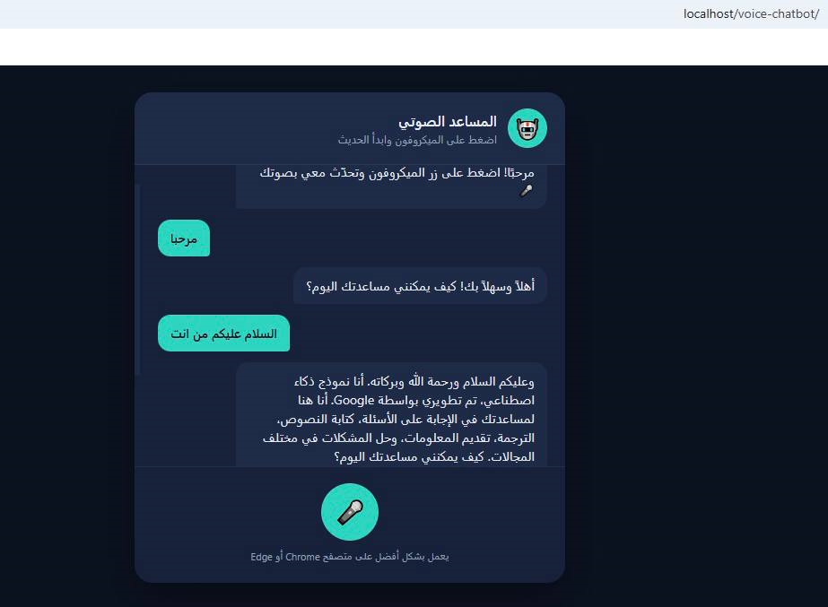

# Voice Chatbot with Gemini AI

A browser-based voice chatbot that uses the Gemini API, Speech Recognition, and Text-to-Speech to provide interactive voice conversations.

---

## About the Project

This project is a voice-enabled AI chatbot that allows users to communicate using their microphone.

The browser converts speech into text using the Web Speech API. The text is then sent securely to a PHP backend, which communicates with the Gemini API and returns the AI response. Finally, the browser reads the response aloud using Text-to-Speech.

---

## Features

- 🎤 Voice input using Speech Recognition
- 🤖 AI responses powered by Gemini API
- 🔊 Text-to-Speech responses
- 💬 Chat interface
- 📱 Responsive design
- 🔒 Secure API key storage using PHP

---

## Technologies Used

- HTML5
- CSS3
- JavaScript
- PHP
- Gemini API
- Web Speech API
- XAMPP (Local Server)

---

## How It Works

1. The user clicks the microphone button.
2. Speech Recognition converts speech into text.
3. JavaScript sends the text to the PHP backend.
4. PHP securely calls the Gemini API.
5. Gemini generates a response.
6. The response is displayed in the chat.
7. The browser reads the response aloud.

---

## Problem Encountered

When testing the chatbot, the application displayed the following message:

> "An error occurred while connecting to the server."

After debugging, the issue was found to be related to the PHP backend and API communication.

The following fixes were applied:

- Fixed the PHP backend configuration.
- Corrected the API request path.
- Added and configured the Gemini API key correctly.
- Updated the API model to a supported version.
- Fixed file paths and project structure.
- Corrected CSS loading issues.
- Tested the chatbot until successful communication with the Gemini API was achieved.

After these fixes, the chatbot successfully received and displayed AI responses.

---

## Screenshot

---

## What I Learned

Through this project I learned how to:

- Debug PHP applications.
- Connect JavaScript with a PHP backend.
- Work with REST APIs.
- Secure API keys.
- Handle API error responses.
- Troubleshoot server-side issues.
- Test and fix communication between the frontend and backend.

---

## Final Result

The voice chatbot now works successfully by:

- Receiving voice input.
- Sending requests to the Gemini API.
- Displaying AI responses.
- Reading responses aloud using Text-to-Speech.

---

Built using HTML, CSS, JavaScript, PHP, and Gemini AI.
